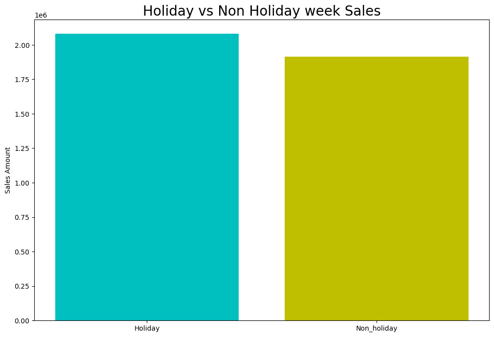
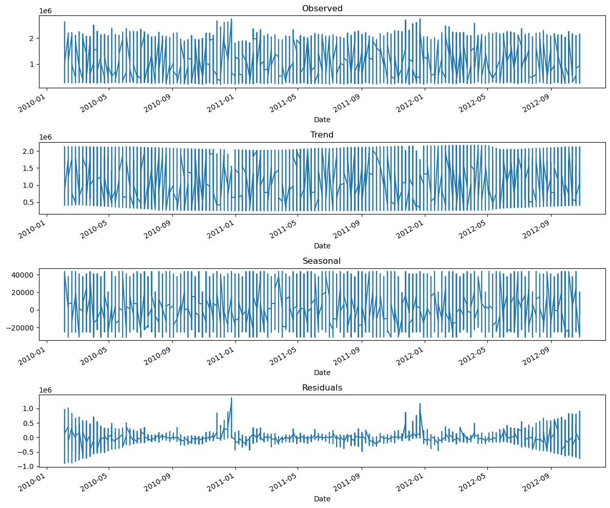

# Walmart Sales Prediction

## Overview

This project focuses on predicting sales for Walmart's 45 stores using time series forecasting techniques. We explored historical sales data, identified seasonal patterns, and leveraged ARIMA and SARIMAX models to make accurate predictions. The goal is to provide actionable insights for inventory management, marketing, and strategic decision-making.

## Project Highlights

- Seasonal Decomposition: We identified significant seasonal patterns in the sales data, which allowed us to capture and utilize these patterns in our forecasting models.

- Advanced Modeling: We employed ARIMA (AutoRegressive Integrated Moving Average) and SARIMAX (Seasonal ARIMA with Exogenous Variables) models for forecasting. These models proved effective in capturing time series trends.

- Impressive Accuracy: Our forecasting models achieved impressive accuracy, which is essential for optimizing Walmart's operations.

## Project Details

### Data Preparation

- The dataset includes sales data for 45 Walmart stores, along with additional information such as holiday flags and temperature.

- We conducted data preprocessing, handling missing values, and outlier removal to prepare the data for analysis.

*Holiday Week vs. Non-Holiday Week Sale*

### Seasonal Decomposition

- Seasonal decomposition analysis helped us understand the components of the time series data, including trend, seasonality, and residual.

*Seasonal Decomposition Graph*

### Forecasting Models

- We explored ARIMA and SARIMAX models to forecast sales. These models consider both historical sales data and exogenous variables, resulting in accurate predictions.

- Our models provide insights into upcoming sales trends, making them valuable for business planning.

## Future Possibilities

This project is just the beginning. There are several future possibilities, including:

- Exploring advanced modeling techniques, such as deep learning and ensemble models.

- Integrating real-time forecasting to continuously update predictions.

- Investigating the impact of external factors like marketing campaigns and customer demographics.

## Acknowledgments

- Thanks to Walmart for providing access to the sales data.

## Contact

For inquiries or collaborations, feel free to connect with me on [LinkedIn](https://www.linkedin.com/in/suyash-pandey2610/).

Happy forecasting!

Thanks
Suyash Pandey

